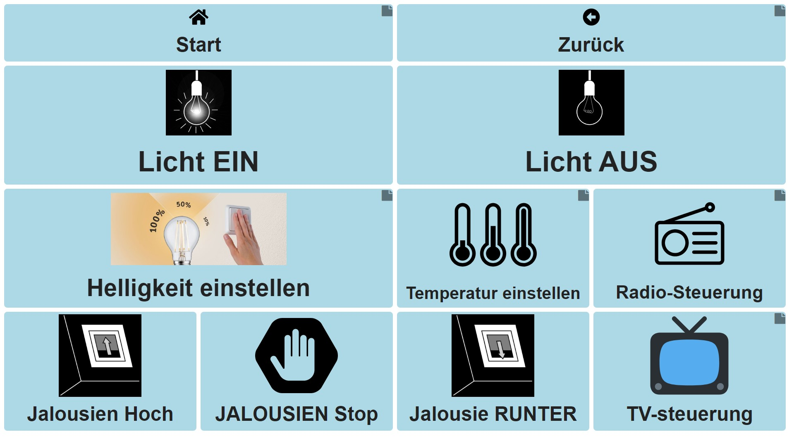

# Protokoll - ATGL LAB
#
## Use Case - Sandra
#
### Aufgabenstellung
TEXT
#
### Klientin: Sandra
Diese Klientin leidet an körperlichen Einschränkungen, die mit einer starken Seh- beeinträchtigung einhergeht. Des Weiteren kann sie Buchstaben nur in dreifacher Größe erkennen und benötigt aufgrund einer Rotsehschwäche (Protanopie) besondere Einstellungen am PC bzw. Laptop. Wir möchten versuchen, ihr mit den technischen Mitteln, die uns zur Verfügung stehen, zu helfen.

Die Klientin ist im Besitz eines Rollstuhls, eines Laptops und eines Smartphones. Da sie nur vergrößerte Buchstaben deutlich sehen kann, müssen ihre Geräte an ihre Sehschwäche angepasst bzw. neu konfiguriert werden. Ihre Protanopie ist aussagekräftig genug um nötige Veränderungen bei den Kontrasteinstellungen vorzunehmen.

Dennoch verfügt sie über einige körperliche Funktionen, die einen größeren Spielraum, im Sinne weiterer Hilfestellungen, darbieten können. Die vollständige Rotation (mit Auf- und Abwärtsbewegung) des Schädels ist gegeben. Außerdem sind Daumen und Zeigefinger des linken Arms intakt.  Bewegung des Mundes und der Lippen und somit auch Sprache sind vorhanden, daher ist eine Verwendung der FlipMouse oder eines Sprachassistenten empfehlenswert.

Die Klientin wünscht sich, dass eine gewisse Autonomie in ihrem Leben zurückkehren kann. Sie hätte gerne die Möglichkeit ihre Umgebung, wie z.B.: Licht, Jalousien, Musik, steuern zu können. Sie würde sich auch über die selbstständige Erzeugung von Klängen und spielen von Computerspielen freuen. Das Surfen im Internet und auch am Smartphone sollte ermöglicht werden, um die Kommunikation mit Freunden aufrechterhalten zu können. Als letzten Wunsch würde sie noch gerne Visuals erzeugen können, die mit Phillips Hue Go oder Infrarotlampen ermöglicht werden kann.

ICF-Classification:
- binocular acuity of distant vision: b21000
- colour vision: b21021
- contrast sensitivity: b21022

## AsTeRICs Grid
TEXT WAS IST Asterics grid

# TEXT ZU BILD

# TEXT ZU BILD

# TEXT ZU BILD

# TEXT ZU BILD

# TEXT ZU BILD

## Ein/Ausgabegerät -  FABI & Tobii-Eye-Tracker & IR-Trans

### Beschreibung FABI

Bei der Einstellung des Fabii achteten wir darauf, dass das FABI extra für den Eye Tracker von Tobii ausgelegt war.

### Beschreibung: Tobii-Eye-Tracker
Der Tobii-Eye-Tracker ist ein Eingabegerät, welches mithilfe einer Augensteuerung den Mauszeiger bewegen kann. es muss zuerst an die Augen angepasst werden und am Laptop montiert werden.

### Anwendung: Tobii-Eye-Tracker
Dabei kann sowohl eingestellt werden, dass die Maus erst nach der Eingabe bewegt wird oder ein Trace am Bildschirm zu sehen ist welche Information über die derzeitige Mausposition gibt.

### Beschreibung: IR-Trans
Das IR Trans ist ein Modul zum Einstellen und auslesen von Infrarot Signalen. Zur sinnvollen Inbetriebnahme wurden zuerst die Eigenschaften des IR-Trans Modules überprüft. Bei der Installation der Software traten einige Fehlermeldungen auf und die Software ließ sich nicht starten. Erst ein Neustart vom Rechner löste die Probleme.

### Konfiguration

Danach wurde als erster Versuch ein IR Signal eingelesen.

Dieses wurde gleich wieder ausgegeben.

Mit Erfolg

### Anwendung

Nun musste das System nur noch an das Asterics-Grid angepasst werden. Dazu wurden in der ARE einige Parameter (wie unten zu sehen) verändert.

Des weiteren wurde das Grid noch mit einer Action ausgestattet.

## Accesibility

### Farbeinstellungen

      Einstellung für Rot-Grün Schwäche(Protanopie)
      
Bei den Farbfiltereinstellungen besteht die Möglichkeit den Laptop auf drei mögliche Sehschwächen einzustellen(Deuteranopie,Protanopie und Tritanopie). Für uns ist die Einstellung für Protanopie wichtig, da unsere Klientin an dieser Schwäche leidet.

### Kontrasteinstellungen

      Kontrast(Grundeinstellungen)

      Abbildung 5:Kontraständerung(Nr.1) 

      Abbildung 5:Kontraständerung(Nr.2)
      

      Kontraständerung(Weiß)
      

      Abbildung 7:Kontraständerung(Schwarz)
      
Bei den Kontrasteinstellung gibt es vier verschiedene Auswahlmöglichkeiten für die Klientin. Man hat die Möglichkeit zwischen Kontrast Nr.1, Kontrast Nr.2, Schwarz und Weiß zu wählen.  

      Individuelle Anpassungen
Außerdem kann die Kontraständerung individuell auf die Klientin angepasst werden.

### Mauszeiger - Einstellungen

      Mauszeiger(Grundeinstellungen)
      
  
      Änderung der Zeigerfarbe
      

      Erweiterte Farbeinstellungen
      

      Einstellung Mauszeigergröße
      
Bei den Einstellungen für den Mauszeiger gibt es einige Möglichkeiten zur personalisierten Einstellung. Die Größe des Mauszeigers kann durch Verschieben des gegebenen Balkens verändert werden. Außerdem ist es möglich, die Farbe des Mauszeigers zu ändern. Man kann von Weiß auf Schwarz wechseln, zusätzlich hat man noch die Möglichkeit jede mögliche Farbe anzupassen. In unserem Fall, spielt die Einstellung der Größe und der Farben eine große Rolle, da unsere Klientin Buchstaben nur in dreifacher Größe erkennt(gilt dementsprechend auch für den Mauszeiger) und an einer Protanopie leidet.

##Aufbau
Beim Aufbau achteten wir besonders darauf, dass das System leicht zu bedienen und leicht zugänglich war. Dabei wurde der Rollstuhl extra dafür prepariert. Dieser wurde mit einem Laptop ausgestattet, welcher mit den ein und Ausgabegeräten verbunden war. An diesem wurde zum Beispiel das Fabii und der Tobii Eye tracker angebracht. Mit diesem Aufbau konnte der gesamte Wohnbereich befahren werden und so ein einfaches bedienen möglich gemacht.

